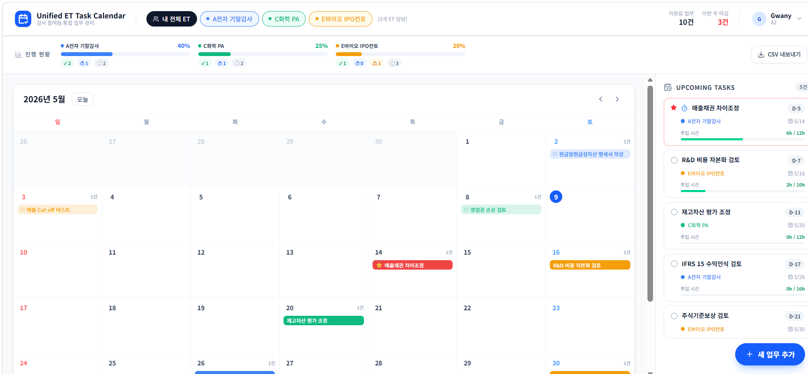
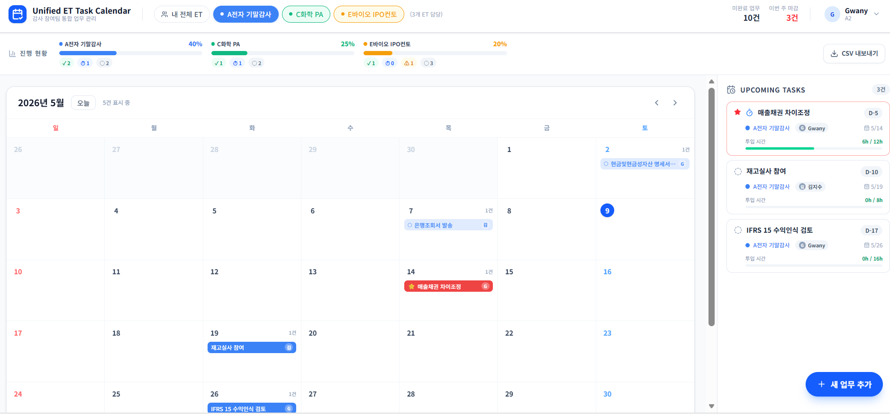

# Unified ET Task Calendar

**[→ 라이브 데모 보기](https://et-calendar-six.vercel.app)**

삼일회계법인의 Pooling 제도 하에서 Staff 회계사는 필연적으로 다수의 ET(Engagement Team)에 소속되어 업무를 수행합니다. 하지만 각 ET마다 과업 공지 및 리마인드 방식이 표준화되어 있지 않아, 스태프 개인이 수많은 채널을 모니터링하며 캘린더에 수기로 일정을 통합해야 하는 비효율이 발생해 왔습니다.

이로 인해 발생하는 KM·PM과의 반복적인 기한 확인은 실무 집중도를 저해하는 '커뮤니케이션 노이즈'가 되었습니다. 본 도구는 이러한 **일정 관리의 파편화**를 해결하고, 회계사 개인의 관점에서 모든 과업의 우선순위를 직관적으로 관리하여 업무 생산성을 극대화하기 위해 기획되었습니다.

### 개인 뷰 — 내가 담당한 ET 업무만 통합 표시


### 팀 전체 뷰 — ET 탭 클릭 시 팀원 전체 업무 및 담당자 표시


### 업무 수정 — KM/PM 코멘트 입력 (캘린더 마우스 오버 시 툴팁 표시)


---

## 주요 기능

- **통합 월간 캘린더** — 여러 ET의 업무 마감일을 한 화면에서 확인
- **ET별 진행 현황 대시보드** — Done / In Progress / To-Do 비율 실시간 표시
- **업무 추가·편집·삭제** — 클릭 한 번으로 태스크 관리 및 상태 변경
- **사용자별 뷰 스코핑** — 본인이 담당한 ET 업무만 표시, 사용자 전환 지원
- **CSV 내보내기** — Excel 한글 호환 UTF-8 BOM 포함 다운로드
- **마감 임박 표시** — 오늘 이전 미완료 업무에 긴급 인디케이터 표시
- **Time Budget 시각화** — 과업별 예산 시간 대비 실투입 시간을 프로그레스 바로 표시 (초과 시 적색 경고)

---

## 향후 비전: 감사 생태계의 데이터 통합

현재 Time Budget 대비 실투입 시간의 수동 기록 및 시각화 기능을 제공하며, 궁극적으로는 전사 시스템(Aura, Time Report)과의 연동을 통해 다음과 같은 가치를 창출하고자 합니다.

- **실시간 진척도 관리** — 감사 조서 시스템(Aura) 연동을 통한 과업 자동 업데이트 및 실시간 모니터링
- **데이터 기반의 리소스 배분** — Time Report 연동을 통해 현재 수동 입력 중인 투입 시간을 자동화하고, 구성원별 업무 부하량 분석 및 공정한 Assign 체계 구축
- **전사적 비용 가시화** — 프로젝트별 실투입 리소스 분석을 통한 정확한 감사 원가 파악 및 관리 효율화
- **Assign 효율화 및 공정성 제고** — Aura·Time Report 연동을 통해 개인에게는 본인이 속한 ET의 업무가, ET 구성원 전체에게는 해당 ET 업무가 공통으로 표시되어 KM·PM이 실시간 부하량을 파악하고 공정한 업무 배분을 실현

---

## 시작하기

```bash
npm install
npm run dev
```

`http://localhost:3000` 에서 확인할 수 있습니다.

## 기술 스택

- [Next.js](https://nextjs.org) — React 풀스택 프레임워크
- TypeScript
- Tailwind CSS
- shadcn/ui
