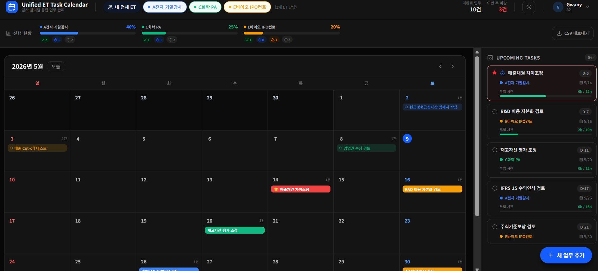

# Unified ET Task Calendar

> 삼일회계법인 Assurance 본부의 다수 ET(Engagement Team) 동시 관리 비효율을 해결하는 통합 업무 캘린더

[](https://nextjs.org)
[](https://www.typescriptlang.org)
[](https://tailwindcss.com)
[](https://et-calendar-six.vercel.app)

**[→ 라이브 데모 보기](https://et-calendar-six.vercel.app)**

---

## 문제 정의 (As-Is)

삼일회계법인 Pooling 제도 하에서 Staff 회계사는 동시에 5개 이상의 ET에 소속되어 업무를 수행합니다.  
그러나 각 ET별 과업 공지 방식이 표준화되어 있지 않아 다음과 같은 비효율이 반복됩니다.

| 구분 | 현재 문제 (Pain Point) |
|------|----------------------|
| 📭 **분산된 공지 채널** | ET마다 KakaoTalk·이메일·구두 전달 방식이 달라 스태프가 수동으로 일정 통합 |
| 🔄 **반복적 기한 확인** | KM·PM에게 진행 현황을 개별 문의해야 하는 커뮤니케이션 노이즈 발생 |
| 📊 **부하 파악 불가** | KM·PM이 팀원의 현재 업무량을 실시간으로 확인할 수단 없음 |
| ⚠️ **우선순위 모호** | 여러 ET의 마감이 겹칠 때 어느 과업을 먼저 해야 하는지 판단 근거 부재 |

---

## 솔루션 (To-Be)

모든 ET의 과업을 **단일 캘린더**에 통합하고, 개인 뷰와 팀 전체 뷰를 분리하여  
스태프는 본인 업무 우선순위를, KM·PM은 팀 전체 부하 현황을 한눈에 파악합니다.

```
Before │ ET별 채팅방 → 수기 캘린더 → 개별 문의 → 혼선
After  │ 통합 캘린더 → 자동 우선순위 → 팀 부하 시각화 → 효율적 Assign
```

---

## 주요 기능

| 기능 | 설명 |
|------|------|
| 📅 **통합 월간 캘린더** | 여러 ET의 마감일을 한 화면에서 색상 구분하여 표시 |
| 👤 **개인 / 팀 뷰 분리** | 기본은 내 담당 업무만, ET 탭 클릭 시 팀 전체 업무 + 담당자 표시 |
| 📊 **팀원 부하 현황 패널** | ET 선택 시 팀원별 To-Do·진행 중·잔여 Time Budget 실시간 표시 |
| 💬 **KM/PM 코멘트** | 과업에 코멘트 첨부, 캘린더 마우스 오버 시 엑셀 메모 방식으로 표시 |
| ⏰ **마감 임박 자동 강조** | D-3 이하 미완료 과업 오렌지 링 자동 표시 (수동 긴급 설정과 별개) |
| ⏱ **Time Budget 시각화** | 예산 대비 실투입 시간 프로그레스 바, 초과 시 적색 경고 |
| 🌙 **다크 모드** | 헤더 버튼으로 라이트/다크 전환, 설정 자동 저장 |
| 📤 **CSV 내보내기** | Excel 한글 호환 UTF-8 BOM 포함 다운로드 |

---

## 스크린샷

<details>
<summary>개인 뷰 — 내가 담당한 ET 업무만 통합 표시</summary>


</details>

<details>
<summary>팀 전체 뷰 — ET 탭 클릭 시 팀원 전체 업무 및 부하 현황 표시</summary>


</details>

<details>
<summary>업무 수정 — KM/PM 코멘트 입력 (캘린더 마우스 오버 시 툴팁 표시)</summary>


</details>

<details>
<summary>다크 모드 — 헤더 Moon/Sun 버튼으로 전환, 설정 자동 저장</summary>



</details>

---

## 기술 스택

| 분류 | 기술 |
|------|------|
| **Framework** | Next.js 16 (App Router) |
| **Language** | TypeScript 5 |
| **Styling** | Tailwind CSS v4, shadcn/ui |
| **Animation** | Framer Motion |
| **State** | useReducer + Context API + localStorage |
| **Deploy** | Vercel (GitHub 자동 배포) |

---

## 시작하기

```bash
npm install
npm run dev
```

`http://localhost:3000` 에서 확인할 수 있습니다.

---

## 향후 비전: 감사 생태계 데이터 통합

현재는 수동 입력 기반이지만, 전사 시스템 연동을 통해 다음 가치를 창출할 수 있습니다.

| 연동 시스템 | 기대 효과 |
|------------|----------|
| **Aura** (감사조서) | 조서 상태 변경 시 과업 자동 업데이트, 진척도 실시간 반영 |
| **Time Report** | 투입 시간 자동 집계, 팀원별 부하량 데이터 기반 분석 |
| **Assign 효율화** | 실시간 부하 데이터를 기반으로 KM·PM이 공정한 업무 배분 실현 |
| **원가 가시화** | 프로젝트별 실투입 리소스 분석으로 감사 원가 정확도 향상 |
