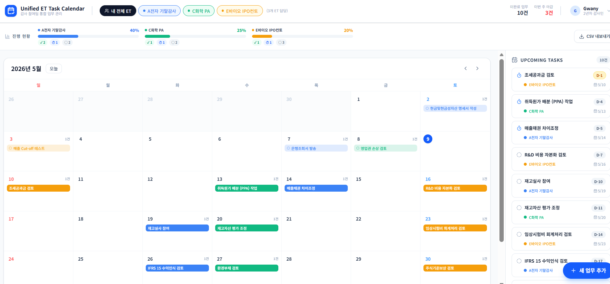

# Unified ET Task Calendar

**[→ 라이브 데모 보기](https://assurance-da-ax-node-r-d.vercel.app)**

삼일회계법인의 Pooling 제도 하에서 주니어 회계사는 필연적으로 다수의 ET(Engagement Team)에 소속되어 업무를 수행합니다. 하지만 각 ET마다 과업 공지 및 리마인드 방식이 표준화되어 있지 않아, 스태프 개인이 수많은 채널을 모니터링하며 캘린더에 수기로 일정을 통합해야 하는 비효율이 발생해 왔습니다.

이로 인해 발생하는 인차지(In-charge)·PM과의 반복적인 기한 확인은 실무 집중도를 저해하는 '커뮤니케이션 노이즈'가 되었습니다. 본 도구는 이러한 **일정 관리의 파편화**를 해결하고, 회계사 개인의 관점에서 모든 과업의 우선순위를 직관적으로 관리하여 업무 생산성을 극대화하기 위해 기획되었습니다.



---

## 주요 기능

- **통합 월간 캘린더** — 여러 ET의 업무 마감일을 한 화면에서 확인
- **ET별 진행 현황 대시보드** — Done / In Progress / To-Do 비율 실시간 표시
- **업무 추가·편집·삭제** — 클릭 한 번으로 태스크 관리 및 상태 변경
- **사용자별 뷰 스코핑** — 본인이 담당한 ET 업무만 표시, 사용자 전환 지원
- **CSV 내보내기** — Excel 한글 호환 UTF-8 BOM 포함 다운로드
- **마감 임박 표시** — 오늘 이전 미완료 업무에 긴급 인디케이터 표시

---

## 향후 비전: 감사 생태계의 데이터 통합

단기적으로는 개인의 통합 뷰를 제공하지만, 궁극적으로는 전사 시스템(Aura, Time Report)과의 연동을 통해 다음과 같은 가치를 창출하고자 합니다.

- **실시간 진척도 관리** — 감사 조서 시스템(Aura) 연동을 통한 과업 자동 업데이트 및 실시간 모니터링
- **데이터 기반의 리소스 배분** — Time Report 연동을 통한 구성원별 업무 부하량 분석 및 공정한 Assign 체계 구축
- **전사적 비용 가시화** — 프로젝트별 실투입 리소스 분석을 통한 정확한 감사 원가 파악 및 관리 효율화

---

## 시작하기

```bash
npm install
npm run dev
```

`http://localhost:3000` 에서 확인할 수 있습니다.

## 기술 스택

- [Next.js](https://nextjs.org) — React 풀스택 프레임워크
- TypeScript
- Tailwind CSS
- shadcn/ui
